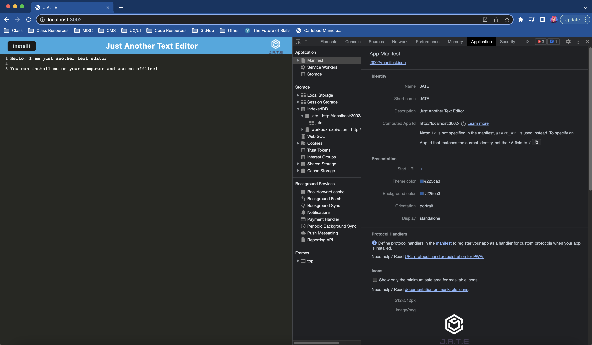

# J.A.T.E. - Just Another Text Editor
## A Progressive Web Application

  ## Table of Contents 
  - [Description](#description)
  - [License](#license)
  - [Installation](#installation)
  - [Usage](#usage)
  - [Contributing](#contributing)
  - [Tests](#test)
  - [Questions](#questions)

  ## Description 
  This PWA is a text editor that runs in a web browser and can be installed and used offline. 

  

  [Click here to visit the deployed link](https://opensource.org/licenses/MIT)

  ## Installation
  Visit the app [here](https://drive.google.com/file/d/1rcHe9Mu5rWNNUQhuwJBDtHPn1AbcWa4I/view) and click install

  ## Usage
  Install and use offline like any other text editor.

  ## License
  This project uses MIT

  [Click here to view license](https://opensource.org/licenses/MIT)

  

  ## Contributing
  Contact me

  ## Tests
  N/A

  ## Questions
  - Author: Stevie Miller
  - GitHub: [StevieMiller](https://github.com/StevieMiller)
  - Email: stephanie.miller@carlsbadschools.net